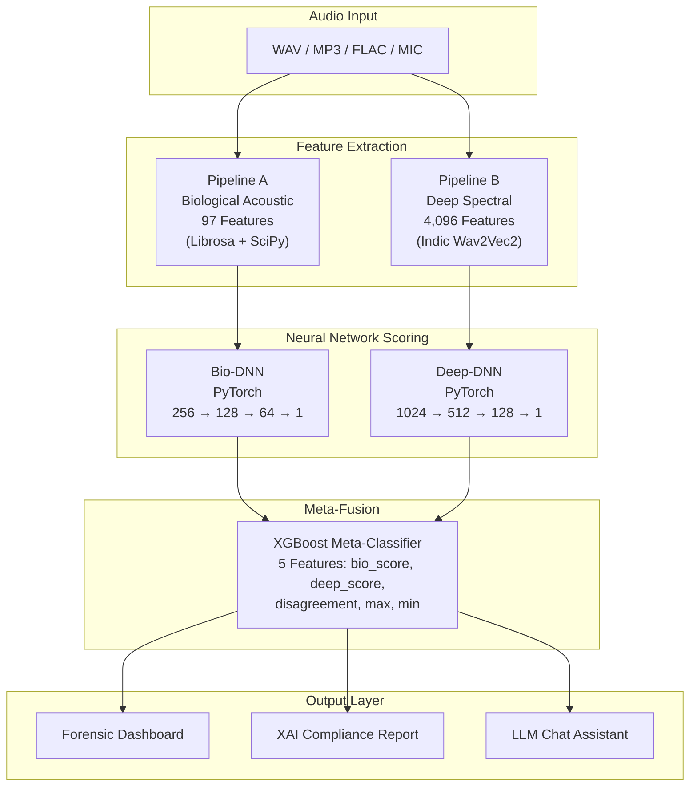

<p align="center">
  
  
  
  
  
  
</p>

<h1 align="center">VoiceGuard</h1>
<h3 align="center">Real-Time AI Voice Fraud Detection Using Zero-Enrollment Dual-Fusion Analysis</h3>

<p align="center">
  <i>A novel system that detects AI-generated voice clones, deepfakes, and synthetic speech by fusing biological acoustic analysis with deep spectral embeddings — no prior voiceprint enrollment required.</i>
</p>

---

## Table of Contents

- [About the Project](#about-the-project)
- [How It Works](#how-it-works)
- [System Architecture](#system-architecture)
- [Feature Engineering](#feature-engineering)
- [Model Architecture](#model-architecture)
- [Quantifiable Results](#quantifiable-results)
- [Dataset](#dataset)
- [Dashboard & Interface](#dashboard--interface)
- [LLM Chatbot (XAI Engine)](#llm-chatbot-xai-engine)
- [Docker Deployment](#docker-deployment)
- [Repository Structure](#repository-structure)
- [Getting Started](#getting-started)
- [Tech Stack](#tech-stack)

---

## About the Project

Generative AI has made it possible to clone any human voice with terrifying accuracy from just **3 seconds of stolen audio**. Tools like ElevenLabs, Fish Audio, F5-TTS, and Resemble AI are freely available — and fraudsters are already using them to impersonate real people over phone calls to authorize transactions, steal identities, and bypass voice-based security systems.

The problem with existing voice biometric systems is that they are **enrollment-dependent**: a person must have pre-recorded their voiceprint before the system can verify them. If they never enrolled, the system is completely blind.

**VoiceGuard** takes a fundamentally different approach. It is a **Zero-Enrollment** system, meaning it does not need to know what your voice sounds like beforehand. Instead of asking *"Does this voice match a known voiceprint?"*, it asks a far more powerful question:

> **"Did this audio come from a real human vocal tract, or was it generated by a machine?"**

To answer this, VoiceGuard runs every audio sample through two completely independent analysis pipelines simultaneously — one that checks for biological vocal cord behavior, and another that analyzes deep spectral patterns using a massive Transformer model. Their outputs are then fused together by a tree-based meta-classifier that produces a single, explainable fraud probability.

This is what we call the **Dual-Fusion Architecture**, and it is the core novelty of VoiceGuard.

---

## How It Works

When an audio file enters VoiceGuard, it passes through three sequential stages. Here is exactly what happens at each stage:

### Stage 1 — Feature Extraction (Two Parallel Pipelines)

The raw audio waveform is simultaneously processed by two independent pipelines:

**Pipeline A: Biological Acoustic Analysis**
The audio is loaded using Librosa and SciPy. From the raw waveform, we extract **97 handcrafted acoustic features** that measure the physical, physiological properties of human speech. These include Pitch (F0) statistics, Jitter (pitch cycle-to-cycle instability), Shimmer (amplitude fluctuation), Harmonics-to-Noise Ratio (HNR), MFCCs, Delta MFCCs, Spectral Centroid, Spectral Flatness, and Formant frequencies (F1–F4). These features capture the microscopic imperfections of a real human throat — imperfections that AI voice generators consistently fail to replicate.

**Pipeline B: Deep Spectral Embedding**
The same audio is also fed into a large pre-trained Transformer model called **Indic Wav2Vec2** (`ai4bharat/indicwav2vec_v1_hindi` from HuggingFace). This model was pre-trained on thousands of hours of Indian language speech using self-supervised learning. We use a **Dual-Pass Multi-Condition Training (MCT)** strategy: the audio is processed once at its native sample rate (e.g., 16kHz for clean audio) and once after being downsampled to 8kHz (simulating telephony-degraded audio). The final hidden states from each pass are mean-pooled and concatenated, producing a **4,096-dimensional deep feature vector**. This captures hidden spectral patterns, phase alignments, and frequency roll-offs that are invisible to traditional acoustic analysis but highly distinctive of synthetic speech.

### Stage 2 — Dual Neural Network Scoring

The 97-dimensional biological feature vector is fed into a **Bio-DNN** (a 4-layer PyTorch neural network: 256→128→64→1). The 4,096-dimensional deep feature vector is fed into a **Deep-DNN** (a 4-layer PyTorch neural network: 1024→512→128→1). Each network independently outputs a probability score between 0 and 1, representing how likely the audio is to be synthetic.

### Stage 3 — XGBoost Meta-Fusion

The two DNN scores are not simply averaged. Instead, they are passed into an **XGBoost meta-classifier** along with three engineered interaction features: their absolute disagreement, their maximum, and their minimum. This 5-feature fusion allows the meta-classifier to learn complex decision boundaries — for example, *"if the Bio model says 80% real but the Deep model says 95% fake, trust the Deep model because it caught a spectral anomaly that biological features missed."*

The XGBoost model outputs the final fraud probability, which is then mapped to a verdict: `LOW_RISK`, `MODERATE`, or `HIGH_RISK / CRITICAL`.

> We chose XGBoost over a third neural network for the fusion stage because (a) it excels at tabular data with only 5 features, (b) it avoids overfitting that a DNN would introduce at this scale, and (c) it provides **feature importance rankings** that power our Explainable AI (XAI) pipeline — making every decision auditable and transparent.

---

## System Architecture



---

## Feature Engineering

### Pipeline A: Biological Acoustic Features (97 Dimensions)

These features measure the physical, physiological properties of human vocal cords. AI-generated speech typically fails to replicate the microscopic imperfections of a real human throat.

| Feature Category | Count | What It Measures |
|:---|:---:|:---|
| Pitch (F0) Statistics | 6 | Mean, Std, Min, Max, Range, Median of fundamental frequency |
| Jitter Variants | 5 | Local Jitter, RAP, PPQ5, DDP — pitch cycle-to-cycle instability |
| Shimmer Variants | 5 | Local Shimmer, APQ3, APQ5, APQ11, DDA — amplitude fluctuation |
| HNR (Harmonics-to-Noise) | 3 | Mean, Std, Max — tonal clarity vs breathiness |
| MFCCs (1–20) | 40 | Mean + Std of 20 Mel-Frequency Cepstral Coefficients |
| Delta MFCCs | 20 | First-order derivatives capturing temporal dynamics |
| Spectral Features | 10 | Centroid, Bandwidth, Rolloff, Flatness, Contrast, ZCR |
| Formants (F1–F4) | 8 | First four formant frequencies + bandwidths |

> **Extraction Tools:** [Librosa](https://librosa.org/) for MFCCs, spectral features, and ZCR. SciPy for pitch tracking, formant estimation, and signal-level jitter/shimmer computation.

### Pipeline B: Deep Spectral Features (4,096 Dimensions)

| Property | Value |
|:---|:---|
| Base Model | `ai4bharat/indicwav2vec_v1_hindi` (HuggingFace) |
| Architecture | Wav2Vec2 Transformer (Self-Supervised Pre-Training) |
| Raw Output Per Pass | 2,048 dimensions (mean-pooled final hidden states) |
| Dual-Pass MCT | Pass 1: Native sample rate (clean) + Pass 2: 8kHz (telephony-degraded) |
| Final Vector | 2,048 + 2,048 = **4,096 dimensions** |

The Dual-Pass Multi-Condition Training (MCT) strategy processes the same audio at two sample rates — one simulating clean studio-quality audio and the other simulating noisy telephone lines. This makes the model robust to real-world audio degradation that would otherwise cause false positives.

---

## Model Architecture

### Bio-DNN (Biological Deep Neural Network)
```
Input (97) → Linear(256) → BatchNorm → ReLU → Dropout(0.3)
          → Linear(128) → BatchNorm → ReLU → Dropout(0.3)
          → Linear(64)  → BatchNorm → ReLU → Dropout(0.3)
          → Linear(1)   → Sigmoid → Bio Score
```

### Deep-DNN (Deep Spectral Neural Network)
```
Input (4096) → Linear(1024) → BatchNorm → ReLU → Dropout(0.4)
            → Linear(512)  → BatchNorm → ReLU → Dropout(0.4)
            → Linear(128)  → BatchNorm → ReLU → Dropout(0.4)
            → Linear(1)    → Sigmoid → Deep Score
```

### XGBoost Meta-Classifier (Final Fusion)
```
Input Features:
  ├── bio_score        (from Bio-DNN)
  ├── deep_score       (from Deep-DNN)
  ├── disagreement     |bio_score - deep_score|
  ├── max_score        max(bio_score, deep_score)
  └── min_score        min(bio_score, deep_score)

Hyperparameters:
  ├── n_estimators: 300
  ├── max_depth: 4
  ├── learning_rate: 0.05
  ├── subsample: 0.8
  └── colsample_bytree: 0.8
```

---

## Quantifiable Results

| Metric | Value |
|:---|:---|
| Meta-Classifier AUC | **0.9999** |
| Meta-Classifier Accuracy | **99.68%** |
| High-Risk Threshold | 0.54 (54%) |
| Medium-Risk Threshold | 0.30 (30%) |
| Total Feature Dimensions | 4,193 (97 Bio + 4,096 Deep) |
| Real-Time Inference | < 3 seconds per audio file |
| Supported Languages | Hindi, English, Bengali, Telugu, Malayalam, Odia |
| Docker Image Size | ~12.4 GB (models baked in) |

---

## Dataset

VoiceGuard was trained on a custom-curated, multi-lingual Indian voice dataset specifically designed for voice spoofing detection.

### Genuine / Real Audio (~49,500+ files)

| Source | Language | Description |
|:---|:---|:---|
| `hindi_real` / `hindi_real_noisy` | Hindi | Real human speech with natural telephony noise |
| `bengali_real_noisy` | Bengali | Native Bengali speakers with ambient noise |
| `telugu_real_noisy` | Telugu | Real Telugu conversations |
| `malyalam_real_noisy` | Malayalam | Real Malayalam speech samples |
| `Odia Real` | Odia | Real Odia language recordings |
| `Eng Real` / `english_real_chunked` | English | English speech samples (chunked for training) |
| `raw_calls` / `raw_real` | Mixed | Raw unprocessed recordings |
| `hard_negatives` | Mixed | Challenging edge cases for robust training |

### Synthetic / Fake Audio (13 categories)

| Source | Generation Tool | Description |
|:---|:---|:---|
| `elevenlabs` | ElevenLabs API | High-quality commercial voice clones |
| `fake-hindi-fish` | Fish Audio | Hindi voice clones from Fish Audio engine |
| `resemble` | Resemble AI | Cloned voices from Resemble AI platform |
| `bengali-fake` | Multiple | Synthetic Bengali speech |
| `Telugu Fake` / `telugu_fake` | Multiple | Synthetic Telugu speech |
| `malyalam-fake` | Multiple | Synthetic Malayalam speech |
| `odia fake` | Multiple | Synthetic Odia speech |
| `generic` | Various TTS | General-purpose TTS-generated speech |
| `fake_ota_master_chunks` | OTA Pipeline | Over-the-air recorded synthetic chunks |

### Pre-Extracted Feature Files

| File | Size | Description |
|:---|:---|:---|
| `bio_features.csv` | ~27 MB | 97 biological features for full dataset |
| `bio_features_live.csv` | ~7 MB | 97 biological features (curated training subset) |
| `deep_features.csv` | ~598 MB | 4,096 deep features for full dataset |
| `deep_features_live.csv` | ~138 MB | 4,096 deep features (curated training subset) |
| `voiceguard.db` | ~25 MB | SQLite database for audit logs and case history |

---

## Dashboard & Interface

VoiceGuard ships with a professional-grade forensic dashboard designed for real-time voice fraud investigation.

### Core Modules

| Module | Description |
|:---|:---|
| Command Center | Real-time system status, hero risk score, case summary, and action buttons |
| Forensic Intelligence | Interactive audio waveform and spectrogram with AI/Real color overlay |
| Temporal Threat Trace | Per-second chunk analysis showing Bio, Deep, and Fused scores across the audio timeline |
| Dual-Fusion Matrix | Radial SVG rings showing Bio vs Deep score breakdown with animated fusion flow |
| Feature Importance Radar | Hexagonal radar chart mapping Jitter, Shimmer, HNR, Pitch, Spectral, and Deep features |
| Threat Vector Analysis | Half-gauge meters for TTS, Voice Clone, and Replay Attack probability |
| Investigation Console | Full case details with XAI findings, threat intelligence, and recommended actions |
| Compliance Report | Printable, audit-ready report with timestamps, scores, and recommendations |
| AI Chat Assistant | Floating LLM chatbot for real-time explainability and compliance guidance |
| Live Microphone Recording | Record audio directly from the browser with real-time waveform visualization |
| Drag & Drop Upload | Upload `.wav`, `.mp3`, `.ogg`, `.flac`, `.m4a` with instant metadata display |
| Active Learning Feedback | Analyst can confirm or correct verdicts for continuous model improvement |

---

## LLM Chatbot (XAI Engine)

The floating chat assistant is a **Context-Aware, RAG-Powered LLM Agent** — not a generic ChatGPT wrapper. It is deeply integrated with the analysis pipeline.

### How It Works

1. **System Prompt Injection** — Before the user types anything, the backend injects a strict persona and ruleset into the LLM, forcing it to act as a domain-specific fraud analyst rather than a generic assistant.

2. **Knowledge Base Loading (`kb_data.json`)** — A structured JSON file containing regulatory guidelines, fraud reporting thresholds, standard operating procedures, and technical definitions (Jitter, Shimmer, HNR, MFCCs, Wav2Vec2) is loaded into the system context.

3. **Live Case Context Injection** — When the user sends a message, the frontend silently bundles the entire `LAST_ANALYSIS` state (risk score, verdict, case ID, threat type) and sends it alongside the user's question. This allows the LLM to give case-specific, real-time advice.

4. **Multi-Layer Failsafe Routing:**

| Layer | Trigger | Response |
|:---|:---|:---|
| Primary | Normal operation | GPT-4o-mini via OpenRouter |
| Fallback 1 | GPT fails (rate limit / timeout) | Auto-switch to Gemini 2.0 Flash |
| Fallback 2 | Complete internet failure | Air-Gapped Offline Mode with hardcoded safe response |

> The Air-Gapped Failsafe ensures the UI never displays a raw error screen during a critical investigation. If the internet drops, the system gracefully switches to Secure Offline Mode.

---

## Docker Deployment

VoiceGuard is fully containerized for secure, reproducible, air-gapped deployment.

```bash
# Build the image (~12.4 GB with models baked in)
docker build -t voiceguard:latest .

# Run the container
docker run -d -p 8001:8001 voiceguard:latest

# Or use Docker Compose
docker-compose up -d
```

**Why Docker?**
- **Air-Gapped Security:** All models are baked into the image. No internet required at runtime.
- **Infrastructure Agnostic:** Runs identically on any server — Linux, Windows, or cloud.
- **Horizontal Scaling:** Spin up multiple containers during peak load, destroy them when traffic drops.
- **Reproducibility:** Every deployment is identical. No dependency or environment issues.

---

## Repository Structure

```
VoiceGuard/
│
├── Dockerfile                       # Docker image build instructions
├── docker-compose.yml               # Docker Compose orchestration
├── .dockerignore                    # Files excluded from Docker build
├── README.md                        # Project documentation
│
├── backend/                         # FastAPI Backend Server
│   ├── main.py                      # Core API (analysis, chat, audit endpoints)
│   ├── auth.py                      # API key authentication middleware
│   ├── db.py                        # SQLite database operations (audit logging)
│   ├── requirements.txt             # Python dependencies
│   └── src/
│       ├── extract_bio.py           # Biological feature extraction (97-dim)
│       ├── extract_bio_live.py      # Live inference bio extraction
│       ├── extract_deep.py          # Deep feature extraction (4096-dim)
│       ├── extract_deep_live.py     # Live inference deep extraction
│       ├── train.py                 # DNN training script
│       ├── train_meta.py            # XGBoost meta-classifier training
│       ├── predict.py               # Inference pipeline
│       └── audit.py                 # Audit trail and compliance logging
│
├── frontend/                        # Enterprise Forensic Dashboard
│   ├── index.html                   # Single-page application (~340 KB)
│   ├── kb_data.json                 # Knowledge Base for LLM chatbot
│   └── generate_kb.py              # KB generation script
│
├── models/                          # Trained Model Weights
│   ├── dl_bio.pt                    # Bio-DNN PyTorch checkpoint (~283 KB)
│   ├── dl_deep.pt                   # Deep-DNN PyTorch checkpoint (~19 MB)
│   ├── meta_classifier.pkl          # XGBoost meta-classifier (~236 KB)
│   ├── meta_config.json             # Thresholds, AUC, accuracy config
│   └── indicwav2vec-hindi/          # Indic Wav2Vec2 Transformer (~1.2 GB)
│
├── ml_pipeline/                     # Standalone ML Training Pipeline
│   ├── extract_bio.py               # Batch bio feature extraction
│   ├── extract_deep.py              # Batch deep feature extraction
│   └── train.py                     # End-to-end training orchestrator
│
└── data/                            # Dataset & Feature Store
    ├── 1_genuine/                   # Real human audio (~49,500+ files)
    ├── 2_synthetic/                 # AI-generated audio (13 categories)
    ├── 3_archive/                   # Archived experimental data
    ├── bio_features.csv             # Pre-extracted bio features (~27 MB)
    ├── bio_features_live.csv        # Curated bio features (~7 MB)
    ├── deep_features.csv            # Pre-extracted deep features (~598 MB)
    ├── deep_features_live.csv       # Curated deep features (~138 MB)
    └── voiceguard.db                # SQLite audit database (~25 MB)
```

---

## Getting Started

### Prerequisites
- Python 3.10+
- CUDA-capable GPU (recommended, but CPU works)
- Docker (optional, for containerized deployment)

### Local Development

```bash
# 1. Clone the repository
git clone https://github.com/your-username/VoiceGuard.git
cd VoiceGuard

# 2. Create virtual environment
python -m venv venv
venv\Scripts\activate        # Windows
# source venv/bin/activate   # Linux/Mac

# 3. Install dependencies
pip install -r backend/requirements.txt

# 4. Start the backend server
cd backend
python main.py
# Server starts at http://localhost:8001

# 5. Open the dashboard
# Navigate to http://localhost:8001 in your browser
```

### Docker Deployment

```bash
docker build -t voiceguard:latest .
docker run -d -p 8001:8001 voiceguard:latest
# Access at http://localhost:8001
```

---

## Tech Stack

| Layer | Technology |
|:---|:---|
| Frontend | Vanilla HTML/CSS/JS, Canvas API, SVG, Tabler Icons |
| Backend | Python 3.10, FastAPI, Uvicorn |
| ML Framework | PyTorch 2.x, XGBoost, Scikit-learn |
| Audio Processing | Librosa, SciPy, SoundFile, torchaudio |
| Deep Learning Model | Indic Wav2Vec2 (HuggingFace Transformers) |
| LLM Integration | OpenRouter API (GPT-4o-mini + Gemini Flash) |
| Database | SQLite |
| Containerization | Docker, Docker Compose |

---

<p align="center">
  <b>If you found this project useful, consider giving it a star.</b>
</p>
