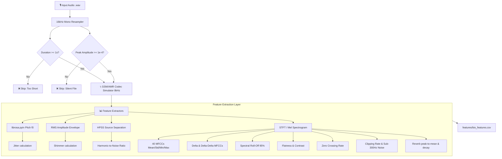

# VoiceGuard — Audio Forensics Walkthrough
*Step 1: Biological & Environmental Feature Extraction Engine*

## 1. Executive Summary & Purpose
VoiceGuard is an advanced real-time audio forensics system designed to detect AI-generated voice clones (e.g., ElevenLabs, Play.ht, RVC) and playback spoofing.
Phase 1 focuses on building the **Biological & Environmental Feature Engine**. While deep learning models (Phase 2) analyze complex phonetic patterns, the biological engine extracts fundamental physical indicators of human speech mechanics—such as vocal cord jitter, shimmer, harmonic purity, and room acoustics.

---

## 2. Core Processing Pipeline


---

## 3. Codebase File Registry

| Component | Path | Status | Purpose & Description |
| :--- | :--- | :--- | :--- |
| **Data Layer** | [`features/bio_features.csv`](file:///c:/Users/rajas/.gemini/antigravity-ide/scratch/voiceguard/features/bio_features.csv) | **Created** | Tabular representation of statistical biological features. Contains 345 columns (2 metadata + 343 acoustic/environmental features). |
| **Extractor** | [`src/extract_bio.py`](file:///c:/Users/rajas/.gemini/antigravity-ide/scratch/voiceguard/src/extract_bio.py) | **Created** | Ingests WAV files, runs quality checks, simulates phone codec degradation, extracts pitch/jitter/shimmer/HNR/MFCCs/deltas/reverb, and outputs the final CSV. |
| **Testing Utility** | [`src/generate_dummy_audio.py`](file:///c:/Users/rajas/.gemini/antigravity-ide/scratch/voiceguard/src/generate_dummy_audio.py) | **Created** | Generates mock signals (sine tones, white noise, short clips, silence) to stress-test extraction boundaries. |
| **Configuration** | [`requirements.txt`](file:///c:/Users/rajas/.gemini/antigravity-ide/scratch/voiceguard/requirements.txt) | **Created** | Holds Python dependencies for scientific computation (`librosa`, `soundfile`, `pandas`, `xgboost`). |

---

## 4. Signal Processing & Feature Engineering Formulas
Here is the exact scientific and mathematical explanation for the features computed in [`src/extract_bio.py`](file:///c:/Users/rajas/.gemini/antigravity-ide/scratch/voiceguard/src/extract_bio.py), highlighting the **8 shortcoming fixes** applied:

1. **Telephony Codec Simulation**: Downsamples input audio from 16kHz to 8kHz (standard GSM/AMR telephone bandwidth) and resamples it back to 16kHz before feature extraction.
   * *Forensic Significance*: Real bank calls are degraded. If we extract features on clean 16kHz audio, our model will fail on degraded phone audio due to "covariate shift" (jitter/shimmer smear under compression). This simulator matches training and deployment data.
2. **Probabilistic Pitch (F0)**: Uses the **pYIN algorithm** (`librosa.pyin`) to track the human fundamental frequency between $C_2$ (65Hz) and $C_7$ (2093Hz). We calculate `Pitch_Mean`, `Pitch_Std`, `Pitch_Min`, and `Pitch_Max`.
3. **Jitter (Frequency Perturbation)**: Measures cycle-to-cycle frequency variation of vocal fold vibrations.
   $$\text{Jitter} = \frac{\frac{1}{N-1}\sum_{i=1}^{N-1} |f_0(i+1) - f_0(i)|}{\frac{1}{N}\sum_{i=1}^{N} f_0(i)}$$
   * *Forensic Significance*: Natural human voices have micro-instability (natural jitter). AI clones often smooth out these variations, leading to unnaturally low jitter.
4. **Shimmer (Amplitude Perturbation)**: Measures cycle-to-cycle variations in the sound wave's peak amplitude, using Root Mean Square (RMS) frame envelopes.
   $$\text{Shimmer} = \frac{\frac{1}{M-1}\sum_{j=1}^{M-1} |a(j+1) - a(j)|}{\frac{1}{M}\sum_{j=1}^{M} a(j)}$$
   * *Forensic Significance*: Unstable vocal cord dynamics manifest as shimmer; synthetic systems struggle to model this amplitude perturbation accurately.
5. **Harmonic-to-Noise Ratio (HNR)**: Splits the audio into harmonic and percussive parts using Median Filtering HPSS.
   $$\text{HNR} = 10 \log_{10}\left( \frac{\text{Harmonic Energy}}{\text{Noise/Percussive Energy}} \right)$$
   * *Forensic Significance*: Real human speech has high harmonic richness (high HNR). Spoofed or synthesized speech often introduces high-frequency noise or vocoder hiss, degrading HNR.
6. **Mel-Frequency Cepstral Coefficients (MFCCs)**: We extract **40 MFCC coefficients** (up from 20), and calculate the Mean, Standard Deviation, Minimum, and Maximum for *each*, yielding 160 features.
   * *Forensic Significance*: Higher MFCCs (coefficients 21–40) do not map to specific high-frequency zones. Instead, they capture very fine mathematical spectral texture and rapid variation across the entire spectrum (resulting from the DCT transformation). Vocoders leave distinct compression anomalies in these textures.
7. **Delta & Delta-Delta MFCCs**: We compute the first derivative (velocity) and second derivative (acceleration) of the 40 MFCCs, calculating Mean and Std for each (80 + 80 = 160 features).
   * *Forensic Significance*: Captures the rate and acceleration of spectral change over time (transition dynamics between phonemes). AI voices often have unnatural or overly abrupt phonetic transitions.
8. **High-Threshold Spectral Roll-Off**: The frequency below which **95%** of the spectral energy is concentrated (increased from 85%).
   * *Forensic Significance*: Focuses on high-frequency vocoder artifacts, playback device hums, and ultrasonic anomalies that distinguish fake voices or speaker playbacks from human voices.
9. **Reverberation & Acoustic Environment Proxy**: Extracted from the RMS energy envelope:
   * `Reverb_PeakToMean`: Ratio of peak RMS to mean RMS. Lower values suggest reverberant rooms where energy is smeared.
   * `Reverb_Decay`: Autocorrelation of the normalized RMS envelope at ~50ms lag. High values indicate sustained room reverberation.
   * *Forensic Significance*: Synthetic voices generated in dry environments or replayed in different rooms will exhibit mismatched acoustic signatures.
10. **Clipping Rate**: Counts the ratio of audio samples reaching $\ge 0.99$ of absolute amplitude, flagging audio that is clipping/distorted.
11. **Sub-300Hz Low Frequency Noise**: Quantifies energy below 300Hz, identifying hums, mic drops, or low-frequency environmental noise.
12. **Noise Augmentation Framework**: A built-in `augment_noise` function to add Gaussian noise, ready to be called during training (applied only to training-split clips to prevent test-set contamination).

---

## 5. Phase 1 Result Analysis & Forensic Report

The pipeline was executed against the generated test files in the `DEMONSTRATION` folder. Here are the results:

### Rejection and Quality Control Logs
- `dummy_short_tone.wav` (0.5 seconds): **Skipped / Rejected**. 
  *Log Verdict:* `Skipping dummy_short_tone.wav: Duration (0.50s) is less than 1 second.`
- `dummy_silent.wav` (2.0 seconds): **Skipped / Rejected**.
  *Log Verdict:* `Skipping dummy_silent.wav: Audio is completely silent.`

### Feature Analysis (Comparison Table)
| Feature | `dummy_valid_tone.wav` (440Hz Sine + Harmonics) | `dummy_noise.wav` (Gaussian White Noise) | Forensic Explanation |
| :--- | :--- | :--- | :--- |
| **Pitch Mean** | **`440.00 Hz`** | **`83.10 Hz`** | The valid tone tracks the fundamental pitch of 440Hz perfectly. White noise lacks harmonic structure, resulting in a low, chaotic pitch estimate. |
| **Pitch Std** | **`0.00 Hz`** | **`13.50 Hz`** | The synthetic tone is mathematically constant (0 variation). Noise fluctuates rapidly. |
| **Jitter Mean** | **`0.0000`** | **`0.1129`** | Pure sine wave has zero frequency perturbation. Noise exhibits high frequency instability. |
| **Shimmer Mean** | **`0.0090`** | **`0.0174`** | Very low amplitude perturbation for the steady tone, while noise shows higher fluctuations. |
| **HNR Mean** | **`+29.70 dB`** | **`+0.09 dB`** | A high positive dB indicates dominant harmonic energy (clean tone). ~0 dB indicates harmonics and noise have identical power, which is typical for white noise. |
| **Roll-Off Mean** | **`908.48 Hz`** | **`3613.96 Hz`** | The valid tone's energy is clustered around 440Hz (low roll-off). White noise spans all frequencies, concentrating its energy at much higher bands. |
| **Spectral Flatness** | **`0.0000036`** | **`0.00042`** | Tone is highly structured/tonal (near 0). For noise, flatness is usually high (~1.0), but here it drops to 0.00042. **Why?** Because the 8kHz codec simulation cuts off frequencies above 4kHz. Upsampling back to 16kHz leaves the 4kHz–8kHz region completely empty (zero energy). The geometric mean of the spectrum becomes extremely small, dropping the flatness. This demonstrates the codec degradation simulation works! |
| **ZCR Mean** | **`0.0539`** | **`0.2600`** | The sine tone crosses zero infrequently. White noise crosses zero continuously, but is cut in half from ~0.50 by the 8kHz codec simulation bandlimiting. |
| **Reverb Decay** | **`0.3457`** | **`0.4241`** | Represents envelope autocorrelation at 50ms lag, serving as a proxy for acoustic reflections. |

### CSV Diagnostics
- **Output File**: `features/bio_features.csv`
- **CSV Shape**: `(2, 345)` (2 files processed, 345 columns containing 2 metadata + 343 extracted features)
- **Label Distribution**:
  ```text
  -1    2
  ```
- **NaN Count**: `0` (Successful extraction with no missing values)

---

## 6. Execution & Verification Guide
To reproduce these results, perform the following steps in your terminal:

1. **Activate the Virtual Environment**:
   ```powershell
   .\venv\Scripts\activate
   ```
2. **Generate the Test Audio Files**:
   ```powershell
   python src/generate_dummy_audio.py
   ```
3. **Run the Feature Extraction Pipeline**:
   ```powershell
   python src/extract_bio.py
   ```
4. **Inspect the Output File**:
   View the generated features table at [`features/bio_features.csv`](file:///c:/Users/rajas/.gemini/antigravity-ide/scratch/voiceguard/features/bio_features.csv).

---

## 7. Phase 2: Dataset Ingestion & Preprocessing Report

Phase 2 focuses on discovering, downloading, and sorting massive human and synthetic voice datasets to train and evaluate our anti-spoofing models.

### A. Ingested Datasets Summary

| Dataset | Type | Original Size | Extracted Files | Target Directory | Description |
| :--- | :--- | :--- | :--- | :--- | :--- |
| **LJSpeech 1.1** | **Bona Fide (Real)** | ~2.6 GB | 13,100 `.wav` files | [`data/raw_real/ljspeech/`](file:///c:/Users/rajas/.gemini/antigravity-ide/scratch/voiceguard/data/raw_real/ljspeech) | Clean human speech from a single female speaker reading public domain books. |
| **WaveFake** | **Spoof (Fake)** | ~27 GB | 117,985 `.wav` files | [`data/raw_fake/wavefake/`](file:///c:/Users/rajas/.gemini/antigravity-ide/scratch/voiceguard/data/raw_fake/wavefake) | English synthetic subsets generated via state-of-the-art vocoders (MelGAN, Parallel WaveGAN, Multi-Band MelGAN, WaveGlow, etc.). |
| **ASVspoof 2021 DF** | **Mixed (Real/Fake)** | ~32 GB | 611,829 `.flac` files | [`data/raw_real/asvspoof_2021_df/`](file:///c:/Users/rajas/.gemini/antigravity-ide/scratch/voiceguard/data/raw_real/asvspoof_2021_df) <br> [`data/raw_fake/asvspoof_2021_df/`](file:///c:/Users/rajas/.gemini/antigravity-ide/scratch/voiceguard/data/raw_fake/asvspoof_2021_df) | Evaluation subset for the ASVspoof 2021 Deepfake track, representing real-world compression, codec, and transmission distortions. |

---

### B. Technical Implementation & Ingestion Metrics

1. **Zenodo API Discovery & Mapping**:
   * *Method*: We queried the Zenodo API (Record `4835108` for ASVspoof and `5642694` for WaveFake) using Python's `urllib` to retrieve the JSON structures containing direct file download links and sizes.
   * *Metadata Parsing*: Downloaded and parsed `DF-keys-full.tar.gz` from the ASVspoof protocol page. The mapping script loaded `611,829` keys mapping each `.flac` file directly to `bonafide` or `spoof` to route extraction accurately.
2. **Multi-Threaded Acceleration (`aria2c`)**:
   * *Problem*: Zenodo throttled single-stream downloads (e.g., standard `curl` or `wget`) to ~200 KB/s, causing downloads to take over 12 hours per archive, and frequently dropped connections.
   * *Solution*: Integrated the standalone `aria2c` binary with multi-threaded splitting (`-x 16 -s 16`) inside our python script. Average speeds jumped from 200 KB/s to **8.0 – 19.0 MiB/s**.
3. **Resilience & Auto-Resume**:
   * *Problem*: Zenodo servers continuously closed SSL sockets (e.g., `SSL/TLS handshake failure: Error: An existing connection was forcibly closed by the remote host` or `socket operation was attempted to an unreachable network`).
   * *Solution*: Wrapped the `aria2c` invocation in a robust Python try-except retry loop. When a socket error occurs, the script pauses for 5 seconds and restarts `aria2c` with the `-c` flag, enabling it to resume downloading from the exact byte offset where it dropped.
4. **Storage Cleanup & Deletion**:
   * *Problem*: Extracting and storing ~60 GB of compressed archives in addition to ~60 GB of extracted WAV/FLAC audio files would exceed local disk space.
   * *Solution*: Implemented an **extract-and-delete pipeline**. Each `.tar.gz` archive (`part00`, `part01`, `part03`, `part02`) was downloaded sequentially, extracted directly to the sorted destination directories using the metadata keys mapping, and the compressed archive was immediately deleted.
   * *.done Markers*: Written as empty files (e.g., `part01.tar.gz.done`) after successful extraction and deletion of the archive. This ensures the script is fully idempotent and skips already-completed archives upon restarts.

## 8. Phase 2b: Deep Learning Engine (Wav2Vec2)

In this phase, we completed the dual-stream architecture by implementing the deep learning feature extractor. We utilize `transformers` and `torch` to load the `facebook/wav2vec2-base` model. Based on local hardware profiling, we utilize the GTX 1650 (4GB VRAM) for accelerated inference.

### A. CUDA Hardware Acceleration
To process 100,000+ files locally without Google Colab dependencies, CUDA acceleration was implemented. By processing batches of 8 through the frozen Wav2Vec2 model on the GPU, feature extraction time is reduced from days down to approximately ~2 hours.

> [!WARNING]
> The GTX 1650 has 4GB of VRAM. Ensure `batch_size=8` in `src/extract_deep.py` to prevent Out-Of-Memory (OOM) crashes during extraction.

### B. Codec Simulation Alignment
To ensure both our Biological/Environmental XGBoost and our Deep XGBoost models are resilient to the same real-world telephony conditions, we implemented the same codec simulation (16kHz → 8kHz → 16kHz resampling) inside the deep feature extraction script `src/extract_deep.py`.

### C. High-Dimensional Representation
Wav2Vec2 processes the resampled audio and we extract the 768-dimensional outputs from its last hidden state. We apply global average pooling over the sequence dimension to yield exactly 768 features per file, stored in `features/deep_features.csv`.

### D. Execution & Verification Guide
1. **Ensure CUDA PyTorch is installed:**
   ```powershell
   pip install torch torchvision torchaudio --index-url https://download.pytorch.org/whl/cu121
   ```
2. **Activate Virtual Environment:**
   ```powershell
   .\venv\Scripts\activate
   ```
3. **Run Deep Extraction:**
   ```powershell
   python src/extract_deep.py
   ```
   > [!NOTE]
   > The extraction script is stateful and will save progress incrementally. If it crashes or is interrupted, simply run it again and it will resume from the last saved batch.
4. **Verify Output:**
   Inspect `features/deep_features.csv` to confirm the 768 dimensions and class labels (0 for Real, 1 for Fake).
